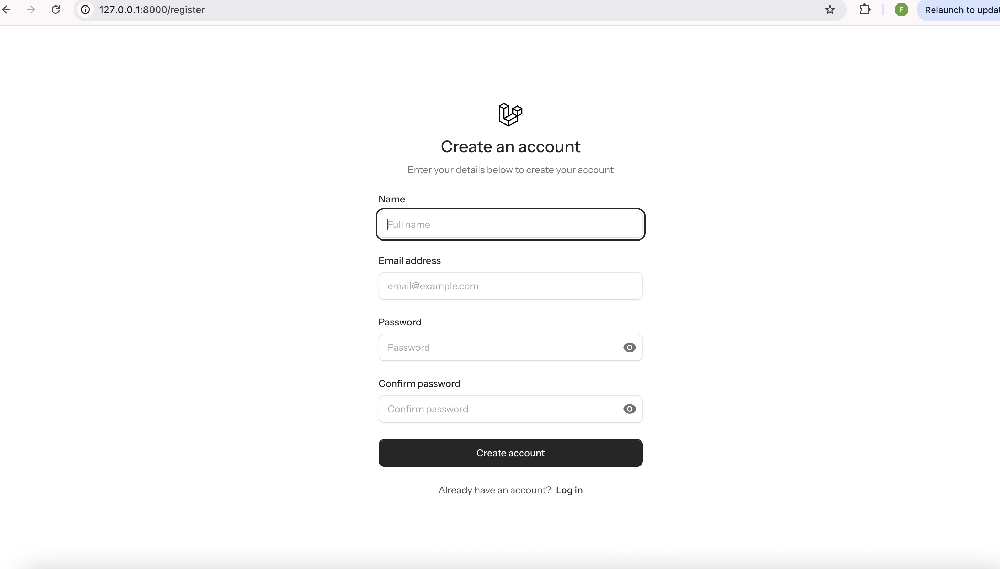
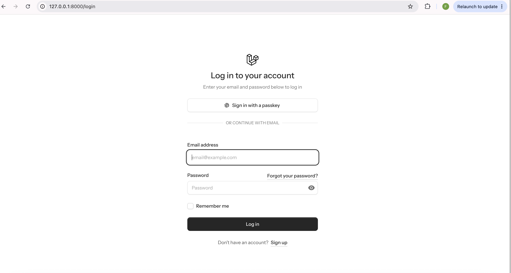
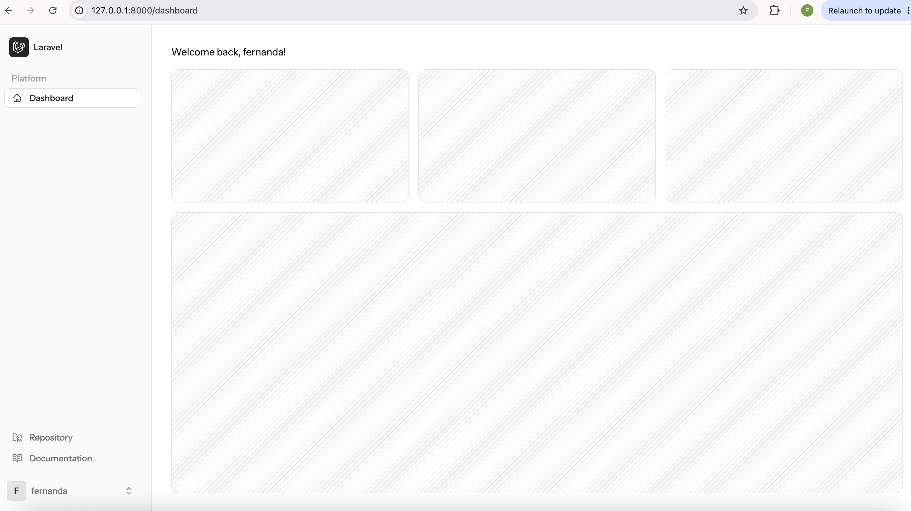
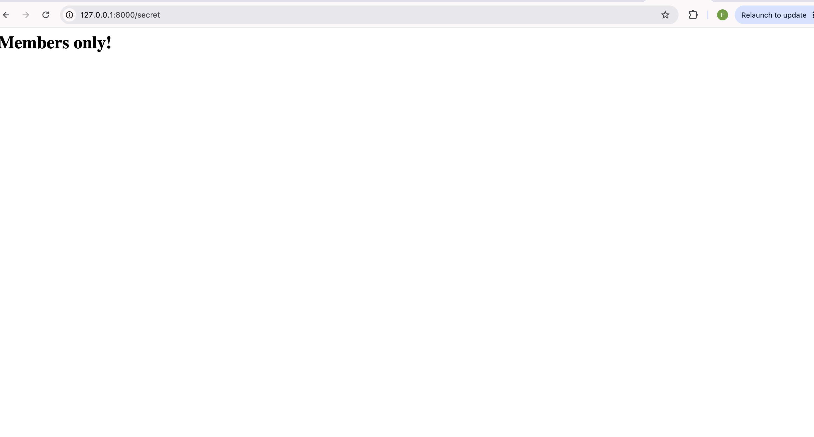
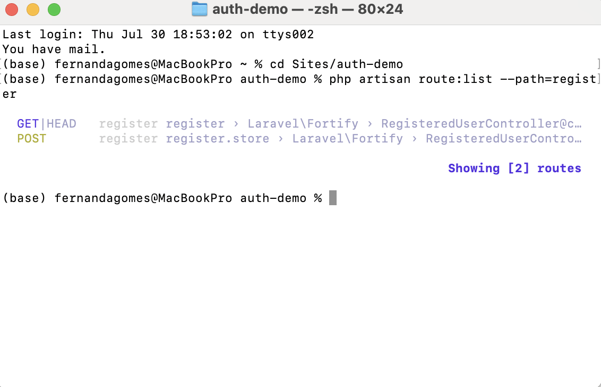

# 🔐 Module 10a — Laravel Authentication Starter Kit

A Laravel 12 authentication system built using the official Fortify starter kit, 
covering registration, login, protected routes, and session-based auth.

## ⚙️ Setup

1. Clone the repo
2. `composer install`
3. `npm install`
4. Copy `.env.example` to `.env` and run `php artisan key:generate`
5. `touch database/database.sqlite`
6. `php artisan migrate`
7. `composer run dev` (or `php artisan serve` + `npm run dev` in separate terminals)

## 📸 Screenshots

### 📝 Registration

### 🔑 Login

### 🏠 Dashboard

### 🕵️ Protected /secret page

### 💻 Terminal — auth routes

## ❓ Short-Answer Questions

1. **What is the difference between authentication and authorization?**
   Authentication is proving who you are (logging in — checking your password matches). 
   Authorization is deciding what you're allowed to do once you're recognized.

2. **Why are passwords hashed instead of stored as plain text?**
   If a database gets breached, hashed passwords keep users safe — plain text ones don't.

3. **Which package registers the /login and /register routes, and which artisan command lets you see them?**
   Laravel Fortify registers the /login and /register routes (along with logout and password reset) — it does this in 
   code rather than in a routes/auth.php file you can open and edit directly.
   `php artisan route:list`

4. **What does the auth middleware do, and what happens when a logged-out user hits a page protected by it?**
   The auth middleware acts as a checkpoint on any route it's attached to — it checks whether the current visitor has an active, 
   logged-in session before letting the request through.
